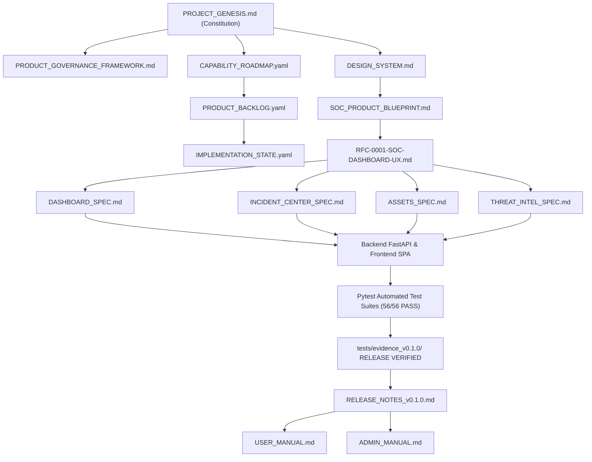

# GESTIVA SECURITY (GESTIVASEC V1) — DOCUMENT KNOWLEDGE GRAPH

---

## 1. RELACIONES ENTRE ARTEFACTOS ARQUITECTÓNICOS

---

## 2. REGLAS DE IMPACTO EN EL KNOWLEDGE GRAPH
1. Un cambio en `PROJECT_GENESIS.md` invalida automáticamente los RFCs activos si viola una regla invariante (`BR-0001` a `BR-0005`).
2. Una actualización en `DESIGN_SYSTEM.md` requiere una revisión inmediata de `DASHBOARD_SPEC.md` e `INCIDENT_CENTER_SPEC.md`.
3. Ningún código fuente en `backend/` o `frontend/` puede existir sin estar enlazado a un RFC y una Especificación.
