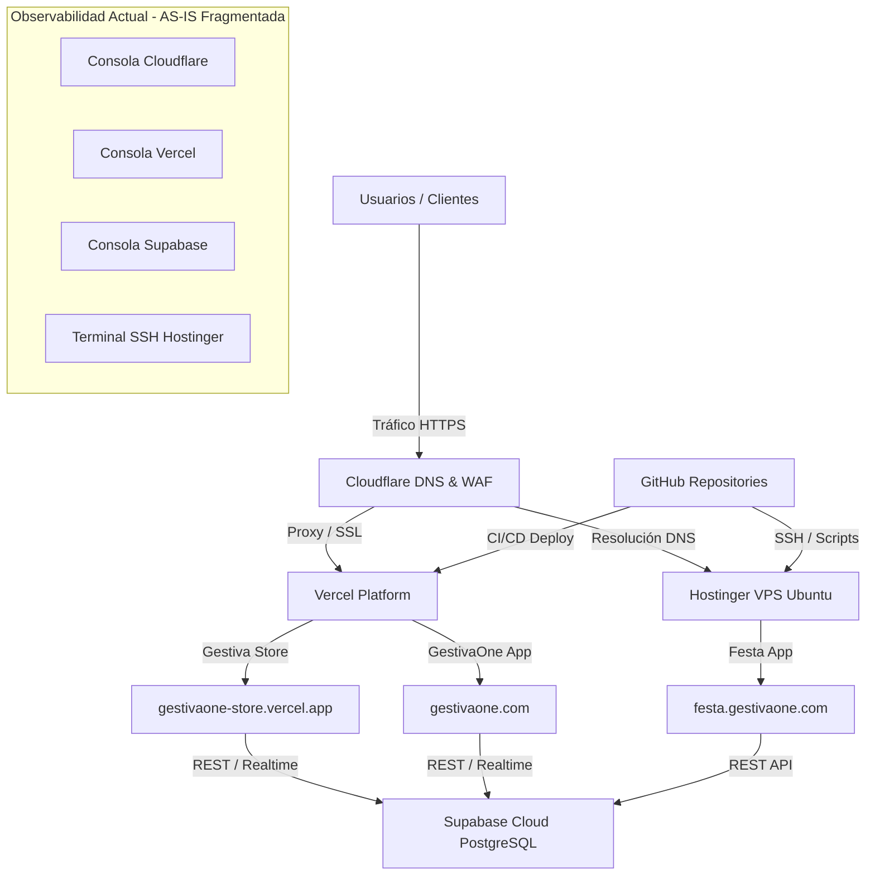

# 1.11 CURRENT STATE (AS-IS) — GESTIVASEC V1
> **Estado**: Descubrimiento de Negocio  
> **Comité**: Equipo Completo de Ingeniería de GestivaSec V1  
> **Fase**: ENTERPRISE DISCOVERY — Subfase 1.11  
> **Fecha**: 2026-07-25  

---

## 1. Executive Summary (Resumen Ejecutivo)

La subfase **1.11 Current State (AS-IS)** documenta de manera puramente descriptiva y objetiva la realidad presente del ecosistema **Gestiva**. Se analiza el estado actual de la infraestructura, los 3 activos en producción (`gestivaone.com`, `gestivaone-store.vercel.app`, `festa.gestivaone.com`), la operativa diaria, la fragmentación de la observabilidad y las limitaciones conocidas, sin proyectar mejoras técnicas ni proponer la solución futura de GestivaSec V1.

---

## 2. Current State Report (Informe del Estado Presente)

### 2.1 Estado de Infraestructura & Aplicaciones
- **Activos Activos en Producción**: 3 plataformas principales operacionales (`gestivaone.com`, `gestivaone-store.vercel.app`, `festa.gestivaone.com`).
- **Topología de Despliegue Presente**:
  - Capa Edge / Frontend: Vercel Platform enrutando el Marketplace (`gestivaone-store.vercel.app`).
  - Capa Perimetral / DNS: Cloudflare gestionando el dominio principal `gestivaone.com` y el subdominio `festa.gestivaone.com`.
  - Capa Cómputo Linux: Servidor VPS Ubuntu en Hostinger ejecutando procesos auxiliares y proxies.
  - Capa Persistencia / Backend: Supabase Managed Platform (Cloud PostgreSQL, Auth, Storage, RLS).
  - Capa Código & CI/CD: Repositorios en GitHub con flujos de integración continua.

### 2.2 Estado de Observabilidad & Operaciones (AS-IS)
- **Monitoreo Fragmentado**: Los operadores e ingenieros deben ingresar manualmente a 4 consolas distintas (Cloudflare Analytics, Vercel Dashboard, Supabase Console y terminal SSH en Hostinger VPS) para verificar la salud del ecosistema.
- **Ausencia de Correlación de Logs**: Los logs de eventos de Supabase no están vinculados a los logs de trafico de Cloudflare ni a los registros del servidor Linux.
- **Gestión de Alertas**: Inexistencia de un motor de alertas unificado de baja latencia para caídas sintéticas o vencimientos preventivos de SSL/TLS.

---

## 3. SWOT / FODA Analysis (Análisis del Estado Actual)

```
┌─────────────────────────────────────────────────────────────────────────────────────────┐
│ ANÁLISIS FODA / SWOT DEL ESTADO ACTUAL (AS-IS)                                          │
├─────────────────────────────────────────────────────────────────────────────────────────┤
│ 🟩 FORTALEZAS (Strengths)                                                               │
│ • Stack moderno de alto rendimiento (Vercel, Supabase, Cloudflare, VPS Linux Hostinger). │
│ • Aislamiento nativo de base de datos con políticas Row Level Security (RLS).           │
│ • Control de versiones centralizado en repositorios GitHub.                             │
├─────────────────────────────────────────────────────────────────────────────────────────┤
│ 🟨 OPORTUNIDADES (Opportunities)                                                         │
│ • Espacio para implementar observabilidad sintética unificada sin afectar producciones. │
│ • Automatización del ciclo de vida de incidentes operacionales.                         │
├─────────────────────────────────────────────────────────────────────────────────────────┤
│ 🟧 DEBILIDADES (Weaknesses)                                                             │
│ • Observabilidad fragmentada en múltiples consolas de terceros.                         │
│ • Verificaciones de disponibilidad y certificados SSL dependientes de revisiones manuales.│
│ • Falta de una fuente única de verdad para el inventario de activos.                    │
├─────────────────────────────────────────────────────────────────────────────────────────┤
│ 🟥 AMENAZAS (Threats)                                                                   │
│ • Expiración no detectada a tiempo de certificados TLS/SSL en dominios corporativos.    │
│ • Bloqueos o rate-limiting imprevistos por cambios de políticas en proveedores cloud.  │
│ • Inexistencia de alertas inmediatas fuera del horario laboral principal.               │
└─────────────────────────────────────────────────────────────────────────────────────────┘
```

---

## 4. Pain Points (Puntos de Dolor Actuales)

1. **Falta de Vista Consolidada (Puntos Ciegos Operativos)**: Imposibilidad de ver la salud global del ecosistema en una sola pantalla.
2. **Inspección Manual de Certificados SSL**: Necesidad de revisar manualmente las fechas de expiración de dominios y subdominios.
3. **Triaje Ineficiente de Fallos**: Dificultad para saber si una falla se origina en Cloudflare, en Vercel, en Supabase o en la VPS de Hostinger.
4. **Desconexión entre Redes y Seguridad**: Los eventos de red (NOC) y los de seguridad (SOC) no se analizan bajo un mismo contexto.

---

## 5. Operational Risks & Known Limitations

### 5.1 Riesgos Operacionales Presentes
- **RISK-ASIS-01 (Severidad: P1 - Crítico)**: Tiempo de detección prolongado ante caídas no planificadas fuera del horario laboral.
- **RISK-ASIS-02 (Severidad: P2 - Alto)**: Dependencia de la memoria individual de los administradores para recordar qué activos están desplegados en qué proveedor.

### 5.2 Limitaciones Conocidas del Estado Actual
- **LIM-01**: Inexistencia de un agente de observabilidad propio instalado en la VPS Hostinger.
- **LIM-02**: Las métricas históricas de latencia se pierden si no se capturan periódicamente fuera de las consolas de proveedores.

---

## 6. Operational Dependencies & Current Asset Map

### Current Asset Map (Mermaid Diagram - Estado Presente)



---

## 7. Información Confirmada

- **CONF-ASIS-01**: El estado actual se caracteriza por la operación independiente de los 3 activos sobre el stack Hostinger, Vercel, Supabase, Cloudflare y GitHub.
- **CONF-ASIS-02**: No existe actualmente una instancia activa de GestivaSec V1 desplegada en producción.

---

## 8. UNKNOWNS & ASSUMPTIONS TO VALIDATE

- **UNK-ASIS-01**: Frecuencia real de consultas manuales que realizan los operadores a la consola de Supabase y Vercel semanalmente.
- **VAL-ASIS-01**: Validar si existen scripts crontab auxiliares actualmente activos en la VPS Hostinger ejecutando monitoreos locales.

---

## 9. Recomendaciones

- Aprobar la subfase **1.11 Current State (AS-IS)** para autorizar el avance a la subfase **1.12 Target State (TO-BE)**.

---

## 10. Confidence Level

```
Confidence Level: 95%
```

---

## 11. Discovery Status

| Subfase Enterprise Discovery | Estado de Avance |
| :--- | :---: |
| **1.1 Business Vision** | 100% (Completado) |
| **1.2 Business Objectives** | 100% (Completado) |
| **1.3 Business Drivers** | 100% (Completado) |
| **1.4 Business Constraints** | 100% (Completado) |
| **1.5 Success Criteria** | 100% (Completado) |
| **1.6 Stakeholders** | 100% (Completado) |
| **1.7 Business Capabilities** | 100% (Completado) |
| **1.8 Business Processes** | 100% (Completado) |
| **1.9 Technology Landscape** | 100% (Completado) |
| **1.10 Infrastructure Inventory** | 100% (Completado) |
| **1.11 Current State (AS-IS)** | 100% (Completado) |
| **1.12 Target State (TO-BE)** | 0% (Pendiente) |
| **1.13 Requirements Discovery** | 0% (Pendiente) |
| **1.14 Enterprise Discovery Review** | 0% (Pendiente) |

---

## 12. READY FOR REVIEW
