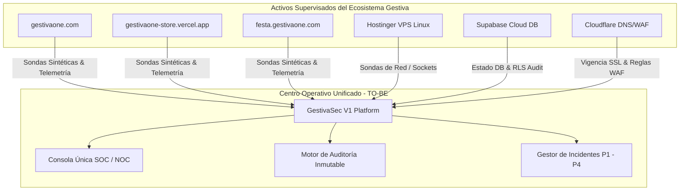

# 1.12 TARGET STATE (TO-BE) — GESTIVASEC V1
> **Estado**: Descubrimiento de Negocio  
> **Comité**: Equipo Completo de Ingeniería de GestivaSec V1  
> **Fase**: ENTERPRISE DISCOVERY — Subfase 1.12  
> **Fecha**: 2026-07-25  

---

## 1. Executive Summary (Resumen Ejecutivo)

La subfase **1.12 Target State (TO-BE)** define la visión funcional del estado objetivo del ecosistema **Gestiva** una vez que la plataforma **GestivaSec V1** entre en operación. El documento establece el modelo operativo unificado, los resultados de negocio esperados (*Business Outcomes*), el modelo de gobierno, las metas de reducción de riesgos y la topología futura de relaciones entre activos, sin introducir arquitecturas técnicas concretas ni selecciones de tecnologías de implementación.

---

## 2. Target State Vision (Visión del Estado Objetivo)

En el estado **TO-BE**, el ecosistema Gestiva contará con una plataforma privada dedicada de operaciones de ciberseguridad (SOC) y observabilidad (NOC) que consolidará la supervisión continua de todos sus activos confirmados (`gestivaone.com`, `gestivaone-store.vercel.app`, `festa.gestivaone.com`).

```
┌─────────────────────────────────────────────────────────────────────────────────────────┐
│ VISIÓN DEL ESTADO OBJETIVO (TO-BE)                                                      │
├─────────────────────────────────────────────────────────────────────────────────────────┤
│                                                                                         │
│     ┌─────────────────────────────────────────────────────────────────────────────┐     │
│     │                       GESTIVASEC V1 (SOC / NOC UNIFICADO)                   │     │
│     │   • Monitoreo Sintético HTTP/HTTPS    • Alertas en Tiempo Real              │     │
│     │   • Supervisión de Certificados SSL   • Inventario Dinámico de Activos        │     │
│     │   • Auditoría Inmutable Multi-Tenant  • Matriz de Incidentes (P1 - P4)       │     │
│     └──────────────────────────────────────┬──────────────────────────────────────┘     │
│                                            │                                            │
│                      Observabilidad & Auditoría Unificada                               │
│                                            │                                            │
│   ┌────────────────────┬───────────────────┴────────────────┬──────────────────────┐    │
│   ▼                    ▼                                    ▼                      ▼    │
│ Hostinger VPS       Vercel Edge                       Supabase Cloud        Cloudflare WAF│
│ (Infra Linux)      (Gestiva Store)                   (Backend DB RLS)       (gestivaone)  │
│                                                                                         │
└─────────────────────────────────────────────────────────────────────────────────────────┘
```

---

## 3. Business Outcomes (Resultados de Negocio Esperados)

1. **Visibilidad Centralizada Inmediata**: Reducción del tiempo de inspección operativa en un 90% al eliminar la necesidad de navegar manualmente entre las consolas de Cloudflare, Vercel, Supabase y la VPS Hostinger.
2. **Erradicación de Caídas por SSL Expirados**: Eliminación total de caídas de navegación segura gracias a alertas automáticas preventivas emitidas con 30 días de antelación.
3. **Respuesta Preventiva a Incidentes**: Notificación instantánea (< 60 segundos) ante cualquier falla de disponibilidad o degradación de latencia en `gestivaone.com`, `gestivaone-store.vercel.app` o `festa.gestivaone.com`.
4. **Soberanía y Transparencia Normativa**: Registro inmutable de auditoría para todas las acciones operacionales y cambios de estado en el ecosistema.

---

## 4. Desired Capabilities (Capacidades Deseadas en el Estado Objetivo)

- **Observabilidad Sintética Activa**: Sondeos periódicos automáticos sobre los 3 activos confirmados sin afectar su rendimiento.
- **Inventario Dinámico de Activos**: Fuente única de verdad que refleje automáticamente el estado y propiedad de cada activo.
- **Gestión del Ciclo de Vida de Incidentes**: Triaje estructurado P1-P4 con asignación de responsables y seguimiento de Causa Raíz (RCA).
- **Aislamiento Multi-Tenant**: Garantía de separación de datos por organización respaldada por políticas inalterables.

---

## 5. Operational & Governance Model (Modelo Operativo y de Gobierno TO-BE)

### 5.1 Modelo Operativo TO-BE
- **Punto Único de Verdad**: Los operadores SOC y NOC utilizarán la consola unificada de GestivaSec V1 como la pantalla primaria de monitoreo y respuesta a incidentes.
- **Flujo de Escalamiento Automatizado**: Las alertas de severidad P1 declaradas por el motor de sondeos se enrutarán automáticamente al Ingeniero NOC/SOC de guardia de acuerdo a la Matriz RACI.

### 5.2 Modelo de Gobierno TO-BE
- **Registro Inmutable de Cambios**: Cualquier modificación en la configuración de ativos o triaje de incidentes generará un evento auditado imborrable.
- **Separación de Funciones (SoD)**: Permisos diferenciados por rol (Dirección, SOC, NOC, DevSecOps, DBA, Auditor).

---

## 6. Risk Reduction Goals (Metas de Reducción de Riesgos)

| Dominio de Riesgo | Estado Presente (AS-IS) | Meta Estado Objetivo (TO-BE) | Porcentaje de Mejora |
| :--- | :--- | :--- | :---: |
| **Tiempo Medio de Detección (MTTD)** | > 15 minutos (O manual) | **< 60 segundos** | **> 93% de reducción** |
| **Caídas por Certificados SSL Expirados** | Riesgo de vencimiento no detectado | **0 caídas por SSL** (Alertas 30 días antes) | **100% de eliminación** |
| **Puntos Ciegos de Observabilidad** | 4 consolas fragmentadas | **1 Consola Unificada SOC/NOC** | **100% de consolidación**|
| **Inalterabilidad de Logs de Auditoría** | Logs dispersos no correlacionados | **100% Logs Inmutables Multi-Tenant** | **100% trazabilidad** |

---

## 7. Future Asset Relationships (Mapa Mermaid TO-BE)



---

## 8. Gap Summary (Brechas a Cerrar entre AS-IS y TO-BE)

1. **Brecha de Consolidación**: Pasar de 4 consolas aisladas (Cloudflare, Vercel, Supabase, Hostinger SSH) a la consola unificada de GestivaSec V1.
2. **Brecha de Automatización de Alertas**: Pasar del monitoreo manual esporádico al motor automatizado con sondeos < 60s.
3. **Brecha de Auditoría**: Pasar de logs no correlacionados a la persistencia inmutable Multi-Tenant.

---

## 9. Información Confirmada

- **CONF-TOBE-01**: El estado objetivo TO-BE responde exclusivamente a la supervisión unificada de `gestivaone.com`, `gestivaone-store.vercel.app` y `festa.gestivaone.com`.
- **CONF-TOBE-02**: El estado objetivo respeta la infraestructura confirmada de Hostinger, Vercel, Supabase, Cloudflare y GitHub.

---

## 10. UNKNOWNS & ASSUMPTIONS TO VALIDATE

- **UNK-TOBE-01**: Integraciones futuras con herramientas externas de mensajería para notificaciones de incidentes P1.

---

## 11. Recomendaciones

- Aprobar la subfase **1.12 Target State (TO-BE)** para autorizar el avance a la subfase **1.13 Requirements Discovery**.

---

## 12. Confidence Level

```
Confidence Level: 95%
```

---

## 13. Discovery Status

| Subfase Enterprise Discovery | Estado de Avance |
| :--- | :---: |
| **1.1 Business Vision** | 100% (Completado) |
| **1.2 Business Objectives** | 100% (Completado) |
| **1.3 Business Drivers** | 100% (Completado) |
| **1.4 Business Constraints** | 100% (Completado) |
| **1.5 Success Criteria** | 100% (Completado) |
| **1.6 Stakeholders** | 100% (Completado) |
| **1.7 Business Capabilities** | 100% (Completado) |
| **1.8 Business Processes** | 100% (Completado) |
| **1.9 Technology Landscape** | 100% (Completado) |
| **1.10 Infrastructure Inventory** | 100% (Completado) |
| **1.11 Current State (AS-IS)** | 100% (Completado) |
| **1.12 Target State (TO-BE)** | 100% (Completado) |
| **1.13 Requirements Discovery** | 0% (Pendiente) |
| **1.14 Enterprise Discovery Review** | 0% (Pendiente) |

---

## 14. READY FOR REVIEW
