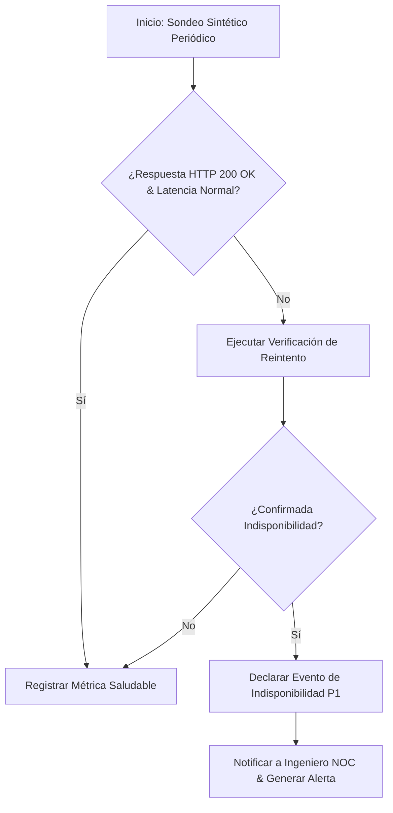
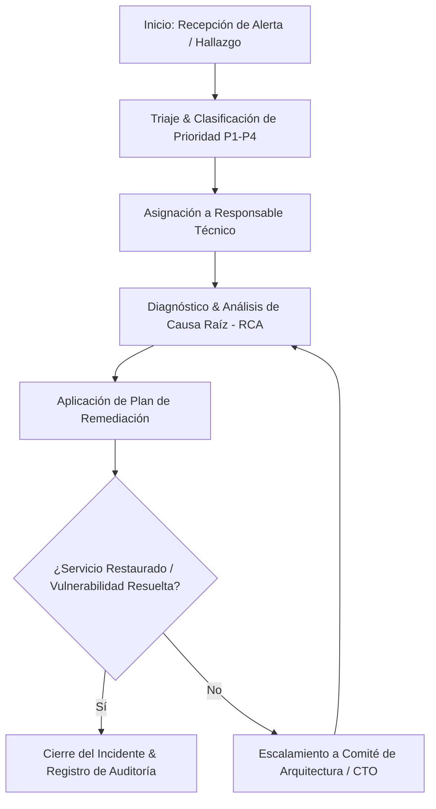
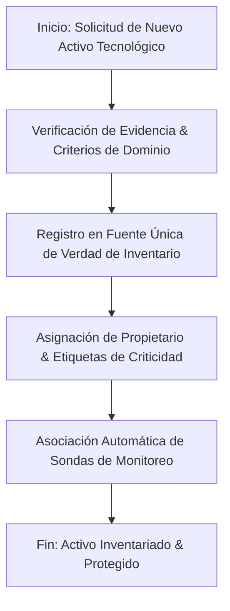

# 1.8 BUSINESS PROCESSES — GESTIVASEC V1
> **Estado**: Descubrimiento de Negocio  
> **Comité**: Equipo Completo de Ingeniería de GestivaSec V1  
> **Fase**: ENTERPRISE DISCOVERY — Subfase 1.8  
> **Fecha**: 2026-07-25  

---

## 1. Resumen Ejecutivo

La subfase **1.8 Business Processes** identifica, mapea y modela los procesos empresariales (no flujos técnicos de código) que serán soportados por la plataforma **GestivaSec V1**. El documento divide los procesos en Primarios (Operativos Core), Secundarios (Tácticos/Gestión) y de Soporte (Auditoría/Gobierno), especificando para cada uno sus actores, entradas, salidas, dependencias y su diagrama de flujo conceptual en Mermaid.js.

---

## 2. Mapa de Procesos de Negocio

```
┌─────────────────────────────────────────────────────────────────────────────────────────┐
│ GESTIVASEC V1 — MAPA DE PROCESOS EMPRESARIALES                                           │
├─────────────────────────────────────────────────────────────────────────────────────────┤
│ 🔴 PROCESOS PRIMARIOS (CORE OPERACIONAL)                                                │
│ • PROC-PRI-01: Detección & Diagnóstico de Disponibilidad (NOC)                          │
│ • PROC-PRI-02: Triaje & Gestión del Ciclo de Vida de Incidentes (SOC/NOC)                │
├─────────────────────────────────────────────────────────────────────────────────────────┤
│ 🔵 PROCESOS SECUNDARIOS (GESTIÓN & TÁCTICA)                                             │
│ • PROC-SEC-01: Alta, Inventariado & Desincorporación de Activos Digitales                │
│ • PROC-SEC-02: Gestión de la Postura de Seguridad & Renovación SSL/TLS                   │
├─────────────────────────────────────────────────────────────────────────────────────────┤
│ 🟣 PROCESOS DE SOPORTE (GOBIERNO & AUDITORÍA)                                           │
│ • PROC-SOP-01: Auditoría Continua, Inmutabilidad & Cumplimiento Normativo                │
└─────────────────────────────────────────────────────────────────────────────────────────┘
```

---

## 3. Desglose de Procesos de Negocio

### 3.1 Procesos Primarios (Core Operational)

#### PROC-PRI-01: Detección & Diagnóstico Operativo de Disponibilidad (NOC)
- **Descripción**: Proceso continuo de supervisión de disponibilidad y tiempo de respuesta sobre los activos del ecosistema (`gestivaone.com`, `gestivaone-store.vercel.app`, `festa.gestivaone.com`).
- **Actores**: Ingeniero NOC, Motores Sintéticos de Monitoreo.
- **Entradas**: Estado de peticiones HTTP/HTTPS, respuesta DNS Cloudflare, latencias de red.
- **Salidas**: Estado de salud actualizado del activo, alerta de degradación o declaración de caída P1.
- **Dependencias**: Infraestructura pública de red, conectividad WAN.



---

#### PROC-PRI-02: Triaje & Gestión del Ciclo de Vida de Incidentes (SOC/NOC)
- **Descripción**: Proceso empresarial para recibir un evento anómalo o falla declarada, asignarlo a un responsable técnico, diagnosticar la causa raíz (RCA) y aplicar la remediación documentada.
- **Actores**: Analista SOC, Ingeniero NOC, DevSecOps, Director CTO.
- **Entradas**: Alerta de indisponibilidad P1-P4, hallazgo de ciberseguridad OWASP/MITRE.
- **Salidas**: Incidente clasificado, plan de remediación, Análisis de Causa Raíz (RCA), resolución y cierre.
- **Dependencias**: Motor de notificaciones y catálogo de activos.



---

### 3.2 Procesos Secundarios (Gestión & Táctica)

#### PROC-SEC-01: Alta, Inventariado & Desincorporación de Activos Digitales
- **Descripción**: Proceso de registro oficial de nuevos dominios, subdominios corporativos, repositorios GitHub o proyectos Vercel/Supabase dentro del inventario unificado.
- **Actores**: Ingeniero DevSecOps, DBA, Administrador de Sistema.
- **Entradas**: Solicitud de creación o modificación de activo tecnológico.
- **Salidas**: Registro de activo etiquetado con dueño asignado y políticas de monitoreo asociadas.
- **Dependencias**: Consolas administradas de Cloudflare, Vercel, Supabase, Hostinger y GitHub.



---

#### PROC-SEC-02: Gestión de la Postura de Seguridad & Renovación SSL/TLS
- **Descripción**: Proceso preventivo para identificar vencimientos próximos de certificados SSL/TLS o desviaciones de seguridad perimetral en Cloudflare.
- **Actores**: Analista SOC, Ingeniero NOC, DevSecOps.
- **Entradas**: Notificación preventiva (<30 días de vencimiento SSL), informe de reglas WAF.
- **Salidas**: Certificado renovado en Cloudflare/Vercel, regla de seguridad actualizada.
- **Dependencias**: Proveedores de certificados X.509 y DNS.

---

### 3.3 Procesos de Soporte (Gobierno & Auditoría)

#### PROC-SOP-01: Auditoría Continua, Inmutabilidad & Cumplimiento Normativo
- **Descripción**: Proceso de captura e inspección no modificable de todas las operaciones realizadas por los stakeholders y servicios para garantizar el cumplimiento normativo.
- **Actores**: Auditor de Cumplimiento, Director CTO.
- **Entradas**: Logs de auditoría de sistema, registros de cambios, políticas RLS.
- **Salidas**: Informe de auditoría no repudiable, evaluación contra marcos ISO 27001 / NIST.
- **Dependencias**: Motor de base de datos Supabase PostgreSQL RLS.

---

## 4. Información Confirmada

- **CONF-PROC-01**: Los 5 procesos descubiertos aplican sobre la gestión de `gestivaone.com`, `gestivaone-store.vercel.app` y `festa.gestivaone.com`.
- **CONF-PROC-02**: Ningún proceso de negocio involucra la elección prematura de herramientas o frameworks de desarrollo.

---

## 5. UNKNOWNS (Vacíos de Información)

- **UNK-PROC-01**: Tiempos máximos de respuesta acordados (SLA de atención) para la asignación inicial de incidentes P1 fuera de horario laboral.

---

## 6. ASSUMPTIONS TO VALIDATE

- **VAL-PROC-01**: Validar si el proceso de cierre de incidentes P1 requiere la firma/aprobación obligatoria del CTO.

---

## 7. Riesgos

- **RISK-PROC-01 (Severidad: P2 - Alto)**: Cuellos de botella en la resolución de incidentes si el proceso de remediación requiere aprobaciones manuales excesivas para parches menores. *(Mitigación: Delegar autoridad según la Matriz RACI)*.

---

## 8. Recomendaciones

- Aprobar la subfase **1.8 Business Processes** para autorizar el avance a la subfase **1.9 Technology Landscape**.

---

## 9. Confidence Level

```
Confidence Level: 90%
```

---

## 10. Discovery Status

| Subfase Enterprise Discovery | Estado de Avance |
| :--- | :---: |
| **1.1 Business Vision** | 100% (Completado) |
| **1.2 Business Objectives** | 100% (Completado) |
| **1.3 Business Drivers** | 100% (Completado) |
| **1.4 Business Constraints** | 100% (Completado) |
| **1.5 Success Criteria** | 100% (Completado) |
| **1.6 Stakeholders** | 100% (Completado) |
| **1.7 Business Capabilities** | 100% (Completado) |
| **1.8 Business Processes** | 100% (Completado) |
| **1.9 Technology Landscape** | 0% (Pendiente) |
| **1.10 Infrastructure Inventory** | 0% (Pendiente) |
| **1.11 Current State (AS-IS)** | 0% (Pendiente) |
| **1.12 Target State (TO-BE)** | 0% (Pendiente) |
| **1.13 Requirements Discovery** | 0% (Pendiente) |
| **1.14 Enterprise Discovery Review** | 0% (Pendiente) |

---

## 11. READY FOR REVIEW
