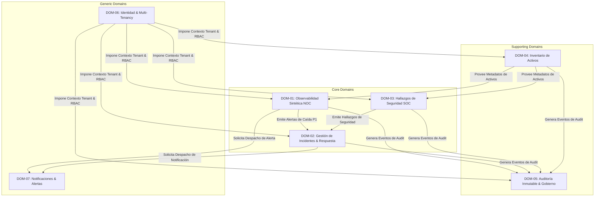

# 2.1 DOMAIN IDENTIFICATION — GESTIVASEC V1
> **Estado**: Descubrimiento de Dominio (DDD)  
> **Comité**: Principal Domain Architect & DDD Expert — Equipo Completo de Ingeniería  
> **Fase**: DOMAIN DISCOVERY — Subfase 2.1  
> **Fecha**: 2026-07-25  

---

## 1. Resumen Ejecutivo

La subfase **2.1 Domain Identification** inicia formalmente la **Fase 2: Domain Discovery** del proyecto **GestivaSec V1**. Aplicando los principios de **Domain-Driven Design (DDD)**, este documento identifica y delimita los 7 dominios de negocio fundamentales de la plataforma, los clasifica estrictamente en Dominios Principales (*Core Domains*), Dominios de Soporte (*Supporting Domains*) y Dominios Genéricos (*Generic Domains*), y establece la matriz de responsabilidades y dependencias entre ellos sobre la infraestructura confirmada (`gestivaone.com`, `gestivaone-store.vercel.app`, `festa.gestivaone.com`). El análisis se mantiene libre de decisiones de código, bases de datos, pantallas o arquitectura técnica.

---

## 2. Domain Catalog (Catálogo Detallado de Dominios de Negocio)

### 2.1 Core Domains (Dominios Principales de Estrategia & Valor)

#### DOM-01: Synthetic Observability & Availability Domain
- **Nombre**: Dominio de Observabilidad Sintética y Disponibilidad (NOC Core)
- **Descripción**: Dominio encargado de orquestar la supervisión sintética pasiva/activa sobre los activos confirmados (`gestivaone.com`, `gestivaone-store.vercel.app`, `festa.gestivaone.com`), midiendo latencias, respuestas HTTP, vigencia SSL/TLS X.509 y transporte (DNS/ICMP/TCP).
- **Propósito**: Proveer visibilidad en tiempo real del estado de salud y rendimiento de los servicios corporativos.
- **Responsabilidad**: Detectar degradaciones y declarar eventos de indisponibilidad sintética con MTTD < 60s.
- **Entradas**: Configuración de sondeos de activos, solicitudes sintéticas periodicas.
- **Salidas**: Métricas de salud, eventos telemétricos de latencia, alertas de caducidad SSL.
- **Dependencias**: `DOM-04` (Inventario de Activos).
- **Actores**: Ingeniero NOC, Motores Sintéticos.
- **Criticidad**: **Crítica (P1)** | **Prioridad**: 1

---

#### DOM-02: Incident Lifecycle & Response Domain
- **Nombre**: Dominio de Ciclo de Vida de Incidentes y Respuesta
- **Descripción**: Dominio responsable del triaje, asignación, seguimiento de escalamiento y cierre del ciclo de vida de incidentes operacionales clasificados de P1 a P4.
- **Propósito**: Garantizar la respuesta estructurada y organizada ante cualquier falla de disponibilidad o evento de seguridad.
- **Responsabilidad**: Gestionar el flujo de estado del incidente y requerir obligatoriamente el Análisis de Causa Raíz (RCA).
- **Entradas**: Alertas declaradas por observabilidad o ciberseguridad.
- **Salidas**: Expedientes de incidentes resueltos, informes RCA, eventos de cambio de estado.
- **Dependencias**: `DOM-01` (Observabilidad), `DOM-03` (Seguridad), `DOM-07` (Notificaciones).
- **Actores**: Analista SOC, Ingeniero NOC, DevSecOps, CTO.
- **Criticidad**: **Crítica (P1)** | **Prioridad**: 1

---

#### DOM-03: Security Findings & Threat Intelligence Domain
- **Nombre**: Dominio de Hallazgos de Seguridad e Inteligencia de Amenazas (SOC Core)
- **Descripción**: Dominio orientado a evaluar la postura de ciberseguridad, clasificar hallazgos de vulnerabilidades bajo marcos OWASP Top 10 y tácticas MITRE ATT&CK, y supervisar el perímetro.
- **Propósito**: Proveer visibilidad situacional de las amenazas y vectores de ataque sobre la superficie expuesta a internet.
- **Responsabilidad**: Categorizar riesgos de seguridad y disparar alertas de hallazgos críticos.
- **Entradas**: Eventos de seguridad, inspección de reglas perimetrales WAF, escaneos de superficie.
- **Salidas**: Matriz de hallazgos de seguridad etiquetados por OWASP/MITRE, eventos de amenazas.
- **Dependencias**: `DOM-04` (Inventario de Activos).
- **Actores**: Analista SOC, Security Architect.
- **Criticidad**: **Alta (P2)** | **Prioridad**: 2

---

### 2.2 Supporting Domains (Dominios de Soporte al Dominio Principal)

#### DOM-04: Asset Inventory & Discovery Domain
- **Nombre**: Dominio de Inventario y Descubrimiento de Activos
- **Descripción**: Dominio que actúa como la fuente única de verdad para catalogar dominios, subdominios corporativos, servidores Linux VPS Hostinger, proyectos Vercel, bases Supabase y repositorios GitHub.
- **Propósito**: Mantener la trazabilidad, propiedad, criticidad y límites lógicos de cada activo tecnológico.
- **Responsabilidad**: Registrar, actualizar y etiquetar activos evitando la existencia de Shadow IT.
- **Entradas**: Solicitudes de alta/baja de activos, descubrimientos de red.
- **Salidas**: Catálogo de activos unificado, metadatos de configuración de sondeos.
- **Dependencias**: Ninguna (Dominio base de conocimiento).
- **Actores**: DevSecOps, DBA, Administrador de Sistemas.
- **Criticidad**: **Crítica (P1)** | **Prioridad**: 1

---

#### DOM-05: Immutable Audit & Governance Domain
- **Nombre**: Dominio de Auditoría Inmutable y Gobierno
- **Descripción**: Dominio encargado de capturar y preservar de forma inalterable todo evento del sistema, acción de usuario o cambio de configuración respetando el aislamiento Multi-Tenant.
- **Propósito**: Garantizar la trazabilidad no repudiable y el soporte para evaluaciones normativas (ISO 27001 / NIST).
- **Responsabilidad**: Persistir eventos de auditoría inmutables e imposibilitar su modificación o borrado.
- **Entradas**: Eventos de auditoría emitidos por cualquiera de los dominios del sistema.
- **Salidas**: Registros de auditoría inmutables, informes de cumplimiento de gobierno.
- **Dependencias**: `DOM-06` (Identidad/Multi-Tenancy).
- **Actores**: Auditor de Cumplimiento, CTO.
- **Criticidad**: **Crítica (P1)** | **Prioridad**: 1

---

### 2.3 Generic Domains (Dominios Genéricos de Infraestructura de Software)

#### DOM-06: Identity, Multi-Tenancy & Access Control Domain
- **Nombre**: Dominio de Identidad, Multi-Tenancy y Control de Acceso
- **Descripción**: Dominio genérico encubridor de la gestión de organizaciones/tenants, cuentas de usuario, autenticación federada, roles (RBAC) y permisos.
- **Propósito**: Garantizar que cada solicitud sea autenticada y autorizada dentro de las fronteras de su tenant.
- **Responsabilidad**: Hacer cumplir las reglas de aislamiento Multi-Tenant y control de acceso por rol.
- **Entradas**: Credenciales de usuario, solicitudes de autenticación/autorización.
- **Salidas**: Contextos de identidad validados, tokens de sesión de tenant.
- **Dependencias**: Ninguna (Dominio genérico transversal).
- **Actores**: Todos los usuarios humanos y sistemas.
- **Criticidad**: **Crítica (P1)** | **Prioridad**: 1

---

#### DOM-07: Alert Routing & Notification Domain
- **Nombre**: Dominio de Enrutamiento de Alertas y Notificación
- **Descripción**: Dominio genérico dedicado a recibir eventos de alerta, aplicar reglas de desduplicación, filtrado por severidad y canalización hacia los stakeholders adecuados.
- **Propósito**: Entregar notificaciones oportunas en tiempo real evitando la fatiga de alertas.
- **Responsabilidad**: Despachar mensajes de alerta hacia los canales de comunicación configurados.
- **Entradas**: Eventos de alerta emitidos por `DOM-01`, `DOM-02` o `DOM-03`.
- **Salidas**: Notificaciones entregadas a los responsables en turno según la Matriz RACI.
- **Dependencias**: `DOM-06` (Identidad/Usuarios).
- **Actores**: Todos los operarios SOC/NOC/DevSecOps.
- **Criticidad**: **Alta (P2)** | **Prioridad**: 2

---

## 3. Domain Map & Classifications (Clasificación Estratégica)

```
┌─────────────────────────────────────────────────────────────────────────────────────────┐
│ MAPA DE DOMINIOS DE NEGOCIO — GESTIVASEC V1                                             │
├─────────────────────────────────────────────────────────────────────────────────────────┤
│ 🔴 CORE DOMAINS (VENTAJA COMPETITIVA & VALOR PRIMARIO)                                  │
│ • DOM-01: Observabilidad Sintética & Disponibilidad (NOC Core)                          │
│ • DOM-02: Ciclo de Vida de Incidentes & Respuesta (Operations Core)                     │
│ • DOM-03: Hallazgos de Seguridad & Amenazas (SOC Core)                                  │
├─────────────────────────────────────────────────────────────────────────────────────────┤
│ 🔵 SUPPORTING DOMAINS (SOPORTE AL DOMINIO PRINCIPAL)                                    │
│ • DOM-04: Inventario & Descubrimiento de Activos (Fuente Única de Verdad)              │
│ • DOM-05: Auditoría Inmutable & Gobierno (No Repudio / Compliance)                       │
├─────────────────────────────────────────────────────────────────────────────────────────┤
│ ⚪ GENERIC DOMAINS (SERVICIOS TRANSVERSALES DE INFRAESTRUCTURA DE SOFTWARE)              │
│ • DOM-06: Identidad, Multi-Tenancy & Control de Acceso (RBAC / Tenants)                 │
│ • DOM-07: Enrutamiento de Alertas & Notificación (Desduplicación / Delivery)            │
└─────────────────────────────────────────────────────────────────────────────────────────┘
```

---

## 4. Domain Relationships (Diagrama de Relaciones en Mermaid)



---

## 5. Domain Responsibility Matrix

| Dominio | Responsabilidad Primaria | Evento Principal Producido | Consumidor Principal |
| :--- | :--- | :--- | :--- |
| **DOM-01** | Sondeos sintéticos y telemetría NOC | `SyntheticCheckFailed`, `SslCertExpiringSoon` | `DOM-02`, `DOM-07` |
| **DOM-02** | Ciclo de vida y RCA de incidentes | `IncidentDeclared`, `IncidentResolvedWithRca` | `DOM-05`, `DOM-07` |
| **DOM-03** | Postura de seguridad y marcos SOC | `SecurityVulnerabilityDiscovered` | `DOM-02`, `DOM-07` |
| **DOM-04** | Fuente única de verdad de activos | `AssetRegistered`, `AssetDecommissioned` | `DOM-01`, `DOM-03` |
| **DOM-05** | Preservación inmutable de audit logs | `AuditEventRecorded` | Auditores / CTO |
| **DOM-06** | Aislamiento Multi-Tenant y RBAC | `UserAuthenticated`, `TenantContextValidated` | Todos los dominios |
| **DOM-07** | Desduplicación y despacho de alertas| `NotificationDispatched` | Stakeholders |

---

## 6. Domain Dependency Matrix

| Dominio Origen | `DOM-01` | `DOM-02` | `DOM-03` | `DOM-04` | `DOM-05` | `DOM-06` | `DOM-07` |
| :--- | :---: | :---: | :---: | :---: | :---: | :---: | :---: |
| **DOM-01 (Observabilidad NOC)** | — | **Depende** | Independiente | **Depende** | **Depende** | **Depende** | **Depende** |
| **DOM-02 (Incidentes)** | **Depende** | — | **Depende** | Independiente | **Depende** | **Depende** | **Depende** |
| **DOM-03 (Seguridad SOC)** | Independiente | **Depende** | — | **Depende** | **Depende** | **Depende** | **Depende** |
| **DOM-04 (Inventario)** | Independiente | Independiente | Independiente | — | **Depende** | **Depende** | Independiente |
| **DOM-05 (Auditoría)** | Independiente | Independiente | Independiente | Independiente | — | **Depende** | Independiente |
| **DOM-06 (Identidad/Auth)** | Independiente | Independiente | Independiente | Independiente | Independiente | — | Independiente |
| **DOM-07 (Notificaciones)** | Independiente | Independiente | Independiente | Independiente | Independiente | **Depende** | — |

---

## 7. Información Confirmada

- **CONF-DOM-01**: Los 7 dominios aislados cubren de forma exhaustiva los requisitos de supervisión del ecosistema (`gestivaone.com`, `gestivaone-store.vercel.app`, `festa.gestivaone.com`).
- **CONF-DOM-02**: Ningún dominio introduce detalles de implementación, motores de búsqueda ni código fuente.

---

## 8. UNKNOWNS & ASSUMPTIONS TO VALIDATE

- **UNK-DOM-01**: Posible necesidad futura de un subdominio especializado de analítica predictiva a largo plazo (diferido).

---

## 9. Recomendaciones

- Aprobar la subfase **2.1 Domain Identification** para autorizar el avance inmediato a la subfase **2.2 Ubiquitous Language**.

---

## 10. Architecture Confidence

```
Architecture Confidence: 95%
```

---

## 11. READY FOR REVIEW
