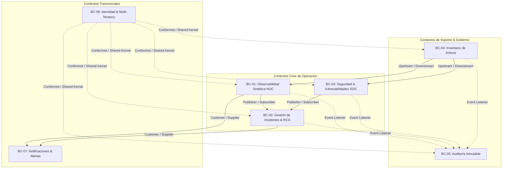

# 2.3 BOUNDED CONTEXT DISCOVERY — GESTIVASEC V1
> **Estado**: Descubrimiento de Dominio (DDD)  
> **Comité**: Principal Domain Architect & DDD Expert — Equipo Completo de Ingeniería  
> **Fase**: DOMAIN DISCOVERY — Subfase 2.3  
> **Fecha**: 2026-07-25  

---

## 1. Resumen Ejecutivo

La subfase **2.3 Bounded Context Discovery** define las fronteras conceptuales explícitas (**Bounded Contexts**) que delimitan los modelos de negocio dentro de **GestivaSec V1**. En concordancia con los principios de Domain-Driven Design (DDD), se especifican 7 Contextos Delimitados, declarando para cada uno sus eventos de dominio, responsables (*Context Owners*), dependencias y relaciones cruzadas, sin proponer microservicios, bases de datos ni estructuras de código.

---

## 2. Context Catalog (Catálogo de Contextos Delimitados)

### BC-01: Synthetic Observability & Probing Context
- **Nombre**: Contexto Delimitado de Observabilidad Sintética y Sondaje (NOC)
- **Propósito**: Supervisión sintética periódica sobre `gestivaone.com`, `gestivaone-store.vercel.app` y `festa.gestivaone.com` para evaluar disponibilidad, latencias, vencimiento de certificados SSL y transporte (DNS/ICMP/TCP).
- **Responsabilidad**: Emitir métricas de salud y declarar eventos de falla cuando se confirme degradación o indisponibilidad.
- **Owner**: Ingeniero NOC
- **Eventos Emitidos**: `SyntheticCheckFailed`, `SyntheticCheckSucceeded`, `SslCertExpiringSoon`, `DnsResolutionFailed`.
- **Relaciones**: Provee eventos telemétricos a `BC-02` (Incidentes) y `BC-07` (Notificaciones).
- **Entradas**: Especificación de sondas de activos desde `BC-04`.
- **Salidas**: Eventos telemétricos y de indisponibilidad declarada.
- **Dependencias**: `BC-04` (Inventario), `BC-06` (Identidad/Multi-Tenancy).

---

### BC-02: Incident Management & RCA Context
- **Nombre**: Contexto Delimitado de Gestión de Incidentes y RCA
- **Propósito**: Orquestación del ciclo de vida de incidentes (P1 a P4) desde la declaración, triaje, asignación de responsables, escalamiento y cierre con Análisis de Causa Raíz (RCA).
- **Responsabilidad**: Garantizar que todo fallo de disponibilidad o seguridad sea abordado y remediado documentalmente.
- **Owner**: Analista SOC / Ingeniero NOC
- **Eventos Emitidos**: `IncidentDeclared`, `IncidentAssigned`, `IncidentEscalated`, `IncidentResolvedWithRca`, `IncidentClosed`.
- **Relaciones**: Recibe disparadores desde `BC-01` y `BC-03`; notifica vía `BC-07`.
- **Entradas**: Eventos de falla o hallazgos de seguridad.
- **Salidas**: Expedientes de incidentes cerrados con RCA.
- **Dependencias**: `BC-01`, `BC-03`, `BC-06`, `BC-07`.

---

### BC-03: Security Posture & Vulnerability Context
- **Nombre**: Contexto Delimitado de Postura de Seguridad y Vulnerabilidades (SOC)
- **Propósito**: Evaluación de hallazgos de seguridad, categorización OWASP / MITRE ATT&CK y supervisión de la superficie perimetral expuesta en Cloudflare/Vercel.
- **Responsabilidad**: Clasificar vulnerabilidades y declarar eventos de amenazas de ciberseguridad.
- **Owner**: Analista SOC / Security Architect
- **Eventos Emitidos**: `SecurityFindingDiscovered`, `SecurityFindingRemediated`, `ThreatAnomalyDetected`.
- **Relaciones**: Emite hallazgos hacia `BC-02` (Incidentes).
- **Entradas**: Métricas de postura perimetral y escaneos de superficie.
- **Salidas**: Eventos de vulnerabilidades clasificadas.
- **Dependencias**: `BC-04` (Inventario), `BC-06` (Identidad/Multi-Tenancy).

---

### BC-04: Asset Inventory & Topology Context
- **Nombre**: Contexto Delimitado de Inventario de Activos y Topología
- **Propósito**: Mantener la fuente única de verdad para el catálogo de activos (dominios, VPS Linux Hostinger, Vercel, Supabase, GitHub) y sus relaciones topológicas.
- **Responsabilidad**: Registrar, actualizar y etiquetar activos impidiendo el Shadow IT.
- **Owner**: Ingeniero DevSecOps
- **Eventos Emitidos**: `AssetRegistered`, `AssetUpdated`, `AssetDecommissioned`.
- **Relaciones**: Alimenta los metadatos de activos para `BC-01` y `BC-03`.
- **Entradas**: Solicitudes de registro/modificación de activos.
- **Salidas**: Definición de activos y mapas de topología.
- **Dependencias**: `BC-06` (Identidad/Multi-Tenancy).

---

### BC-05: Immutable Audit & Governance Context
- **Nombre**: Contexto Delimitado de Auditoría Inmutable y Gobierno
- **Propósito**: Captura y preservación inalterable de todos los eventos de auditoría y cambios operacionales con aislamiento Multi-Tenant.
- **Responsabilidad**: Persistir eventos no repudiables y garantizar el no repudio.
- **Owner**: Auditor de Cumplimiento / CTO
- **Eventos Emitidos**: `AuditEventRecorded`, `AuditPolicyEnforced`.
- **Relaciones**: Escucha pasivamente los eventos de todos los demás contextos.
- **Entradas**: Eventos de dominio emitidos por `BC-01` a `BC-07`.
- **Salidas**: Trazas de auditoría inmutables para reportes.
- **Dependencias**: `BC-06` (Identidad/Multi-Tenancy).

---

### BC-06: Identity & Multi-Tenancy Context
- **Nombre**: Contexto Delimitado de Identidad y Multi-Tenancy (Transversal)
- **Propósito**: Autenticación de usuarios, administración de organizaciones/tenants, asignación de roles (RBAC) e imposición del aislamiento `tenant_id`.
- **Responsabilidad**: Garantizar que todo acceso sea autenticado y autorizado dentro de las fronteras del tenant.
- **Owner**: DBA / Plataforma
- **Eventos Emitidos**: `UserAuthenticated`, `TenantContextSet`, `RolePermissionGranted`.
- **Relaciones**: Provee contexto de autorización a todos los demás Bounded Contexts.
- **Entradas**: Credenciales y solicitudes de autorización.
- **Salidas**: Tokens de contexto de tenant validados.
- **Dependencias**: Ninguna (Contexto base transversal).

---

### BC-07: Alert Routing & Delivery Context
- **Nombre**: Contexto Delimitado de Enrutamiento y Entrega de Alertas
- **Propósito**: Filtrado, desduplicación y despacho de notificaciones hacia los stakeholders correspondientes según la Matriz RACI.
- **Responsabilidad**: Despachar alertas a los canales de comunicación evitando fatiga de alertas.
- **Owner**: DevSecOps / SRE
- **Eventos Emitidos**: `NotificationDispatched`, `NotificationDeliveryFailed`.
- **Relaciones**: Recibe solicitudes de despacho desde `BC-01` y `BC-02`.
- **Entradas**: Solicitudes de notificación con severidad P1-P4.
- **Salidas**: Alertas entregadas a destinatarios.
- **Dependencias**: `BC-06` (Identidad/Usuarios).

---

## 3. Context Map (Mapa de Contextos Delimitados en Mermaid)



---

## 4. Context Ownership Matrix & Priority

| Código BC | Bounded Context | Context Owner | Prioridad | Criticidad | Evento Clave Emitido |
| :--- | :--- | :--- | :---: | :---: | :--- |
| **BC-01** | Observabilidad Sintética NOC | Ingeniero NOC | **P1 (Crítica)** | Alta | `SyntheticCheckFailed` |
| **BC-02** | Gestión Incidentes & RCA | Analista SOC / NOC | **P1 (Crítica)** | Alta | `IncidentDeclared` |
| **BC-03** | Seguridad SOC & Vulnerabilidades| Analista SOC | **P2 (Alta)** | Alta | `SecurityFindingDiscovered` |
| **BC-04** | Inventario de Activos | Ingeniero DevSecOps | **P1 (Crítica)** | Alta | `AssetRegistered` |
| **BC-05** | Auditoría Inmutable | Auditor / CTO | **P1 (Crítica)** | Alta | `AuditEventRecorded` |
| **BC-06** | Identidad & Multi-Tenancy | DBA / Plataforma | **P1 (Crítica)** | Alta | `TenantContextSet` |
| **BC-07** | Enrutamiento de Notificaciones | DevSecOps / SRE | **P2 (Alta)** | Media | `NotificationDispatched` |

---

## 5. Context Dependencies Matrix

| Bounded Context | `BC-01` | `BC-02` | `BC-03` | `BC-04` | `BC-05` | `BC-06` | `BC-07` |
| :--- | :---: | :---: | :---: | :---: | :---: | :---: | :---: |
| **BC-01 (Observabilidad NOC)**| — | Consumidor | Independiente | **Depende** | **Emite** | **Depende** | **Solicita** |
| **BC-02 (Incidentes & RCA)**| **Consume**| — | **Consume** | Independiente | **Emite** | **Depende** | **Solicita** |
| **BC-03 (Seguridad SOC)** | Independiente | Consumidor | — | **Depende** | **Emite** | **Depende** | Independiente |
| **BC-04 (Inventario Activos)**| Proveedor | Independiente | Proveedor | — | **Emite** | **Depende** | Independiente |
| **BC-05 (Auditoría Inmutable)**| Escucha | Escucha | Escucha | Escucha | — | **Depende** | Independiente |
| **BC-06 (Identidad/Tenant)** | Proveedor | Proveedor | Proveedor | Proveedor | Proveedor | — | Proveedor |
| **BC-07 (Notificaciones)** | Despacha | Despacha | Independiente | Independiente | Independiente | **Depende** | — |

---

## 6. Información Confirmada

- **CONF-BC-01**: Los 7 Bounded Contexts cubren de forma exhaustiva la frontera de conocimiento requerida sobre los activos `gestivaone.com`, `gestivaone-store.vercel.app` y `festa.gestivaone.com`.
- **CONF-BC-02**: Ningún Bounded Context impone decisiones de microservicios, bases de datos o código fuente.

---

## 7. UNKNOWNS & ASSUMPTIONS TO VALIDATE

- **UNK-BC-01**: Evaluación de volumen aproximado de eventos de dominio por hora proyectados para `BC-01` y `BC-05`.

---

## 8. Recomendaciones

- Aprobar la subfase **2.3 Bounded Context Discovery** para autorizar el avance a la subfase **2.4 Context Mapping**.

---

## 9. Architecture Confidence

```
Architecture Confidence: 95%
```

---

## 10. READY FOR REVIEW
