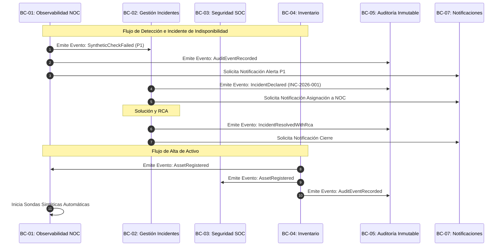

# 2.4 DOMAIN EVENTS — GESTIVASEC V1
> **Estado**: Descubrimiento de Dominio (DDD)  
> **Comité**: Principal Domain Architect & DDD Expert — Equipo Completo de Ingeniería  
> **Fase**: DOMAIN DISCOVERY — Subfase 2.4  
> **Fecha**: 2026-07-25  

---

## 1. Resumen Ejecutivo

La subfase **2.4 Domain Events** descubre y documenta los **Eventos de Dominio** primarios que representan hechos inmutables ocurridos en el negocio dentro de **GestivaSec V1**. En concordancia con los principios de Domain-Driven Design (DDD) y la directiva de diferimiento de tecnologías (ADR-0003), este análisis define los eventos con sus triggers de negocio, payloads conceptuales, Bounded Contexts productores y consumidores, sin implementar middleware de mensajería ni seleccionar brokers específicos.

---

## 2. Domain Event Catalog (Catálogo Detallado de Eventos de Dominio)

### EVT-01: `SyntheticCheckFailed`
- **Nombre del Evento**: `SyntheticCheckFailed`
- **Descripción**: Se ha verificado la falla o degradación no respondida en el sondeo sintético sobre un activo supervisado (`gestivaone.com`, `gestivaone-store.vercel.app` o `festa.gestivaone.com`).
- **Bounded Context Origen**: `BC-01` (Observabilidad Sintética NOC)
- **Trigger**: Petición HTTP retorna código de estado no-200 o agota el tiempo de espera (timeout) tras reintentos.
- **Payload Conceptual**:
  ```json
  {
    "event_id": "UUID",
    "tenant_id": "gestiva-core-tenant",
    "asset_id": "AST-02",
    "target_url": "https://gestivaone.com",
    "http_status": 503,
    "response_time_ms": 5000,
    "failure_reason": "HTTP_503_SERVICE_UNAVAILABLE",
    "timestamp": "2026-07-25T17:20:00Z"
  }
  ```
- **Consumidores**: `BC-02` (Incidentes), `BC-05` (Auditoría), `BC-07` (Notificaciones).
- **Impacto**: Declaración automática de estado no saludable y disparo de triaje P1.
- **Prioridad**: **Crítica (P1)**

---

### EVT-02: `SslCertExpiringSoon`
- **Nombre del Evento**: `SslCertExpiringSoon`
- **Descripción**: La fecha de caducidad del certificado TLS/SSL X.509 de un activo se encuentra a 30 días o menos de su expiración.
- **Bounded Context Origen**: `BC-01` (Observabilidad Sintética NOC)
- **Trigger**: Verificación sintética SSL detecta días de vigencia restante ≤ 30.
- **Payload Conceptual**:
  ```json
  {
    "event_id": "UUID",
    "tenant_id": "gestiva-core-tenant",
    "asset_id": "AST-03",
    "domain_name": "gestivaone-store.vercel.app",
    "days_remaining": 28,
    "expiration_date": "2026-08-22T00:00:00Z",
    "issuer": "Vercel SSL Authority",
    "timestamp": "2026-07-25T17:20:00Z"
  }
  ```
- **Consumidores**: `BC-02` (Incidentes), `BC-05` (Auditoría), `BC-07` (Notificaciones).
- **Impacto**: Generación de alerta preventiva para renovación sin indisponibilidad.
- **Prioridad**: **Alta (P2)**

---

### EVT-03: `IncidentDeclared`
- **Nombre del Evento**: `IncidentDeclared`
- **Descripción**: Se ha registrado formalmente un nuevo incidente operacional o de seguridad en el sistema con un nivel de prioridad P1-P4.
- **Bounded Context Origen**: `BC-02` (Gestion de Incidentes & RCA)
- **Trigger**: Recepción de `SyntheticCheckFailed` o declaración manual por un operador SOC/NOC.
- **Payload Conceptual**:
  ```json
  {
    "incident_id": "INC-2026-001",
    "tenant_id": "gestiva-core-tenant",
    "asset_id": "AST-01",
    "priority": "P1",
    "summary": "Caída de resolución DNS en gestivaone.com",
    "assigned_role": "NOC_ENGINEER",
    "declared_at": "2026-07-25T17:20:00Z"
  }
  ```
- **Consumidores**: `BC-05` (Auditoría), `BC-07` (Notificaciones).
- **Impacto**: Notificación inmediata y apertura del expediente de ciclo de vida del incidente.
- **Prioridad**: **Crítica (P1)**

---

### EVT-04: `IncidentResolvedWithRca`
- **Nombre del Evento**: `IncidentResolvedWithRca`
- **Descripción**: Un incidente P1 ha sido resuelto formalmente adjuntando la documentación del Análisis de Causa Raíz (RCA).
- **Bounded Context Origen**: `BC-02` (Gestión de Incidentes & RCA)
- **Trigger**: El responsable asignado registra el cierre con el informe RCA completado.
- **Payload Conceptual**:
  ```json
  {
    "incident_id": "INC-2026-001",
    "tenant_id": "gestiva-core-tenant",
    "root_cause": "Falla de propagación DNS en Cloudflare Edge",
    "remediation_action": "Purga de caché y restablecimiento de registros A/AAAA",
    "resolved_by": "noc-lead@gestiva.com",
    "resolved_at": "2026-07-25T17:20:00Z"
  }
  ```
- **Consumidores**: `BC-05` (Auditoría), `BC-07` (Notificaciones).
- **Impacto**: Cierre formal del incidente y registro inmutable de la causa técnica.
- **Prioridad**: **Alta (P2)**

---

### EVT-05: `SecurityFindingDiscovered`
- **Nombre del Evento**: `SecurityFindingDiscovered`
- **Descripción**: Se ha identificado una vulnerabilidad o desviación de configuración en la superficie de un activo.
- **Bounded Context Origen**: `BC-03` (Seguridad SOC & Vulnerabilidades)
- **Trigger**: Inspección perimetral detecta una vulnerabilidad o regla WAF comprometida.
- **Payload Conceptual**:
  ```json
  {
    "finding_id": "SEC-2026-088",
    "tenant_id": "gestiva-core-tenant",
    "asset_id": "AST-05",
    "owasp_category": "A05:2021-Security Misconfiguration",
    "mitre_tactic": "TA0001-Initial Access",
    "severity": "HIGH",
    "discovered_at": "2026-07-25T17:20:00Z"
  }
  ```
- **Consumidores**: `BC-02` (Incidentes), `BC-05` (Auditoría).
- **Impacto**: Apertura de triaje de ciberseguridad en la matriz SOC.
- **Prioridad**: **Alta (P2)**

---

### EVT-06: `AssetRegistered`
- **Nombre del Evento**: `AssetRegistered`
- **Descripción**: Un nuevo activo tecnológico ha sido registrado e incorporado a la fuente única de verdad de inventario.
- **Bounded Context Origen**: `BC-04` (Inventario de Activos y Topología)
- **Trigger**: Un administrador o DevSecOps registra un activo con sus 12 propiedades formales.
- **Payload Conceptual**:
  ```json
  {
    "asset_id": "AST-04",
    "tenant_id": "gestiva-core-tenant",
    "asset_name": "Festa App",
    "target_url": "https://festa.gestivaone.com",
    "criticality": "P2",
    "owner_email": "devsecops@gestiva.com",
    "registered_at": "2026-07-25T17:20:00Z"
  }
  ```
- **Consumidores**: `BC-01` (Observabilidad), `BC-03` (Seguridad), `BC-05` (Auditoría).
- **Impacto**: Activación de sondas sintéticas automáticas y escaneos de superficie sobre el nuevo activo.
- **Prioridad**: **Crítica (P1)**

---

### EVT-07: `AuditEventRecorded`
- **Nombre del Evento**: `AuditEventRecorded`
- **Descripción**: Preservación inalterable e inmutable de un evento de auditoría en la capa de gobierno.
- **Bounded Context Origen**: `BC-05` (Auditoría Inmutable y Gobierno)
- **Trigger**: Ocurrencia de cualquier acción de usuario o evento de dominio susceptible de auditoría.
- **Payload Conceptual**:
  ```json
  {
    "audit_id": "AUD-991823",
    "tenant_id": "gestiva-core-tenant",
    "actor_email": "operator@gestiva.com",
    "action": "INCIDENT_PRIORITY_UPDATED",
    "entity_type": "INCIDENT",
    "entity_id": "INC-2026-001",
    "recorded_at": "2026-07-25T17:20:00Z"
  }
  ```
- **Consumidores**: Motores de reportes y auditoría de cumplimiento.
- **Impacto**: Garantía de no repudio y cumplimiento normativo.
- **Prioridad**: **Crítica (P1)**

---

## 3. Mermaid Event Flow (Diagrama de Flujo de Eventos)



---

## 4. Business Event Timeline & Event Relationships

| Secuencia Típica | Evento Desencadenante | Evento Derivado Reaccionado | Bounded Contexts Involucrados |
| :---: | :--- | :--- | :--- |
| **Paso 1** | `AssetRegistered` | Habilita sondas sintéticas | `BC-04` ➔ `BC-01` |
| **Paso 2** | `SyntheticCheckFailed` | Declara incidente P1 de indisponibilidad | `BC-01` ➔ `BC-02` |
| **Paso 3** | `IncidentDeclared` | Despacha alertas a ingenieros de guardia | `BC-02` ➔ `BC-07` |
| **Paso 4** | `IncidentResolvedWithRca` | Registra auditoría inmutable de causa raíz | `BC-02` ➔ `BC-05` |

---

## 5. Información Confirmada

- **CONF-EVT-01**: Los 7 eventos de dominio especifican las interacciones semánticas puras entre los Bounded Contexts de GestivaSec V1.
- **CONF-EVT-02**: Ningún evento impone proveedores de mensajería (Kafka, RabbitMQ, Redis, NATS) respetando el ADR-0003.

---

## 6. UNKNOWNS & ASSUMPTIONS TO VALIDATE

- **UNK-EVT-01**: Tasa máxima estimada de emisión simultánea de eventos durante picos de inestabilidad de red.

---

## 7. Recomendaciones

- Aprobar la subfase **2.4 Domain Events** para autorizar el avance a la subfase **2.5 Core Domain Deep Dive**.

---

## 8. Architecture Confidence

```
Architecture Confidence: 95%
```

---

## 9. READY FOR REVIEW
