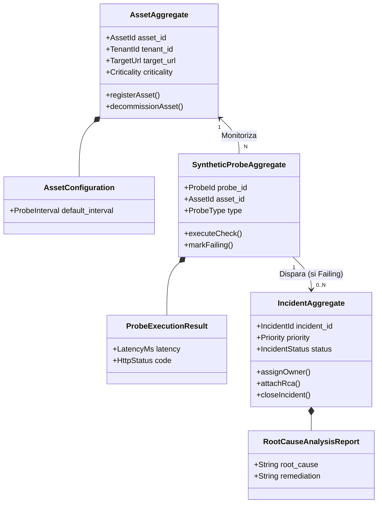
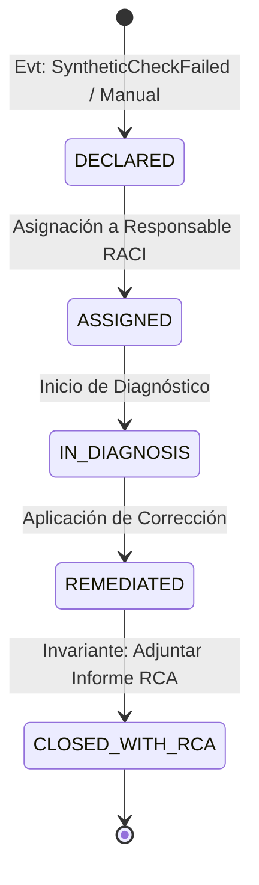

# 2.5 AGGREGATES — GESTIVASEC V1
> **Estado**: Descubrimiento de Dominio (DDD)  
> **Comité**: Principal Domain Architect & DDD Expert — Equipo Completo de Ingeniería  
> **Fase**: DOMAIN DISCOVERY — Subfase 2.5  
> **Fecha**: 2026-07-25  

---

## 1. Resumen Ejecutivo

La subfase **2.5 Aggregates** descubre y delimita los **Agregados de Dominio (Domain Aggregates)** primarios de **GestivaSec V1**. Aplicando los patrones formales de Domain-Driven Design (DDD), se especifican 5 Agregados centrales declarando para cada uno su Raíz de Agregado (*Aggregate Root*), Entidades Hijas (*Child Entities*), Objetos de Valor (*Value Objects*), Invariantes de Consistencia, Ciclo de Vida y diagramas de estados en Mermaid.js, sin diseñar esquemas SQL ni tablas de base de datos.

---

## 2. Aggregate Catalog (Catálogo de Agregados de Dominio)

### AGG-01: AssetAggregate (Agregado de Activo Tecnológico)
- **Nombre**: Agregado de Activo Tecnológico
- **Bounded Context**: `BC-04` (Asset Inventory & Topology Context)
- **Descripción**: Unidad de consistencia que encapsula la identidad, propiedades, configuración y etiquetas de un activo tecnológico del ecosistema.
- **Aggregate Root**: `Asset`
- **Entidades Hijas**: `AssetConfiguration`, `AssetTag`
- **Value Objects**: `AssetId`, `TargetUrl`, `Environment` (PRODUCTION), `Criticality` (P1-P4), `TenantId`
- **Invariantes de Dominio**:
  1. Un `Asset` debe estar asociado obligatoriamente a un `TenantId` válido.
  2. La `TargetUrl` debe ser una dirección bien formada correspondiente a los dominios autorizados (`gestivaone.com`, `gestivaone-store.vercel.app`, `festa.gestivaone.com`).
  3. Un `Asset` en estado `DECOMMISSIONED` no puede estar asociado a sondas sintéticas activas.
- **Lifecycle**: `DRAFT` ➔ `REGISTERED` ➔ `ACTIVE` ➔ `DEGRADED` ➔ `DECOMMISSIONED`.

---

### AGG-02: SyntheticProbeAggregate (Agregado de Sonda Sintética)
- **Nombre**: Agregado de Sonda Sintética (NOC)
- **Bounded Context**: `BC-01` (Synthetic Observability & Probing Context)
- **Descripción**: Unidad de consistencia encargada de gestionar el ciclo de ejecución y los resultados de verificaciones de disponibilidad HTTP/HTTPS, SSL, DNS e ICMP.
- **Aggregate Root**: `SyntheticProbe`
- **Entidades Hijas**: `ProbeExecutionResult`
- **Value Objects**: `ProbeId`, `ProbeInterval`, `ProbeType` (HTTP, SSL, DNS, TCP), `LatencyMs`, `CertValidityWindow`
- **Invariantes de Dominio**:
  1. El `ProbeInterval` no puede ser inferior a 10 segundos para prevenir sobrecarga pasiva.
  2. Si `ProbeExecutionResult` registra 3 fallos consecutivos en `LatencyMs` o `HttpStatus`, el estado del agregado debe cambiar obligatoriamente a `FAILING`.
- **Lifecycle**: `SCHEDULED` ➔ `EXECUTING` ➔ `HEALTHY` / `FAILING` ➔ `PAUSED`.

---

### AGG-03: IncidentAggregate (Agregado de Incidente)
- **Nombre**: Agregado de Incidente Operacional
- **Bounded Context**: `BC-02` (Incident Management & RCA Context)
- **Descripción**: Unidad de consistencia que gobierna el expediente del incidente, su historial de actividad, escalamiento y remediación documentada.
- **Aggregate Root**: `Incident`
- **Entidades Hijas**: `IncidentActivityLog`, `RootCauseAnalysisReport`
- **Value Objects**: `IncidentId`, `Priority` (P1-P4), `IncidentStatus`, `SlaDeadline`, `TenantId`
- **Invariantes de Dominio**:
  1. Ningún incidente de prioridad `P1` puede transitar al estado `CLOSED` sin poseer un `RootCauseAnalysisReport` completado.
  2. El `SlaDeadline` es inmutable una vez calculado en la declaración inicial.
- **Lifecycle**: `DECLARED` ➔ `ASSIGNED` ➔ `IN_DIAGNOSIS` ➔ `REMEDIATED` ➔ `CLOSED_WITH_RCA`.

---

### AGG-04: SecurityFindingAggregate (Agregado de Hallazgo de Seguridad)
- **Nombre**: Agregado de Hallazgo de Seguridad (SOC)
- **Bounded Context**: `BC-03` (Security Posture & Vulnerability Context)
- **Descripción**: Unidad de consistencia que encapsula la detección, clasificación y plan de remediación de vulnerabilidades OWASP/MITRE.
- **Aggregate Root**: `SecurityFinding`
- **Entidades Hijas**: `RemediationStep`
- **Value Objects**: `FindingId`, `OwaspCategory`, `MitreTactic`, `Severity` (CRITICAL, HIGH, MEDIUM, LOW)
- **Invariantes de Dominio**:
  1. Todo hallazgo con `Severity` igual a `CRITICAL` debe gatillar automáticamente la creación de una solicitud de incidente en `IncidentAggregate`.
- **Lifecycle**: `DISCOVERED` ➔ `ANALYZED` ➔ `REMEDIATION_PENDING` ➔ `RESOLVED` ➔ `FALSE_POSITIVE`.

---

### AGG-05: AuditLogAggregate (Agregado de Registro de Auditoría)
- **Nombre**: Agregado de Registro de Auditoría Inmutable
- **Bounded Context**: `BC-05` (Immutable Audit & Governance Context)
- **Descripción**: Unidad de consistencia que representa la captura inalterable e infalsificable de un evento no repudiable.
- **Aggregate Root**: `AuditLogRecord`
- **Entidades Hijas**: Ninguna (Agregado inmutable de una sola pieza).
- **Value Objects**: `AuditLogId`, `ActorId`, `ActionType`, `EntityRef`, `TenantId`, `ImmutableTimestamp`
- **Invariantes de Dominio**:
  1. Un `AuditLogRecord` es completamente inmutable: no posee operaciones de modificación ni borrado en su ciclo de vida.
- **Lifecycle**: `RECORDED` (Estado único inalterable).

---

## 3. Aggregate Relationships (Mapa de Agregados en Mermaid)



---

## 4. Lifecycle Diagrams (Diagramas de Ciclo de Vida de Agregados)

### Ciclo de Vida del Agregado de Incidente (`IncidentAggregate`)



---

## 5. Business Ownership Matrix

| Agregado de Dominio | Aggregate Root | Bounded Context | Business Owner | Invariante Clave |
| :--- | :--- | :--- | :--- | :--- |
| **AGG-01** | `Asset` | `BC-04` Inventario | DevSecOps | Pertenece a un TenantId y URL autorizada. |
| **AGG-02** | `SyntheticProbe` | `BC-01` Observabilidad | Ingeniero NOC | 3 fallos consecutivos cambian estado a FAILING. |
| **AGG-03** | `Incident` | `BC-02` Incidentes | Analista SOC / NOC | P1 no cierra sin informe RCA completado. |
| **AGG-04** | `SecurityFinding` | `BC-03` Seguridad SOC | Security Architect | Severity CRITICAL gatilla incidente automático. |
| **AGG-05** | `AuditLogRecord` | `BC-05` Auditoría | Auditor / CTO | Inmutabilidad total: Cero modificación/borrado. |

---

## 6. Información Confirmada

- **CONF-AGG-01**: Los 5 Agregados de Dominio garantizan la consistencia transaccional de los Bounded Contexts de GestivaSec V1.
- **CONF-AGG-02**: Ningún Agregado introduce tablas SQL, tipos de base de datos ni código de implementación.

---

## 7. UNKNOWNS & ASSUMPTIONS TO VALIDATE

- **UNK-AGG-01**: Tiempo máximo tolerado para la retención del ciclo de vida de los incidentes cerrados (`CLOSED_WITH_RCA`).

---

## 8. Recomendaciones

- Aprobar la subfase **2.5 Aggregates** para autorizar el avance a la subfase **2.6 Domain Services & Policies**.

---

## 9. Architecture Confidence

```
Architecture Confidence: 95%
```

---

## 10. READY FOR REVIEW
