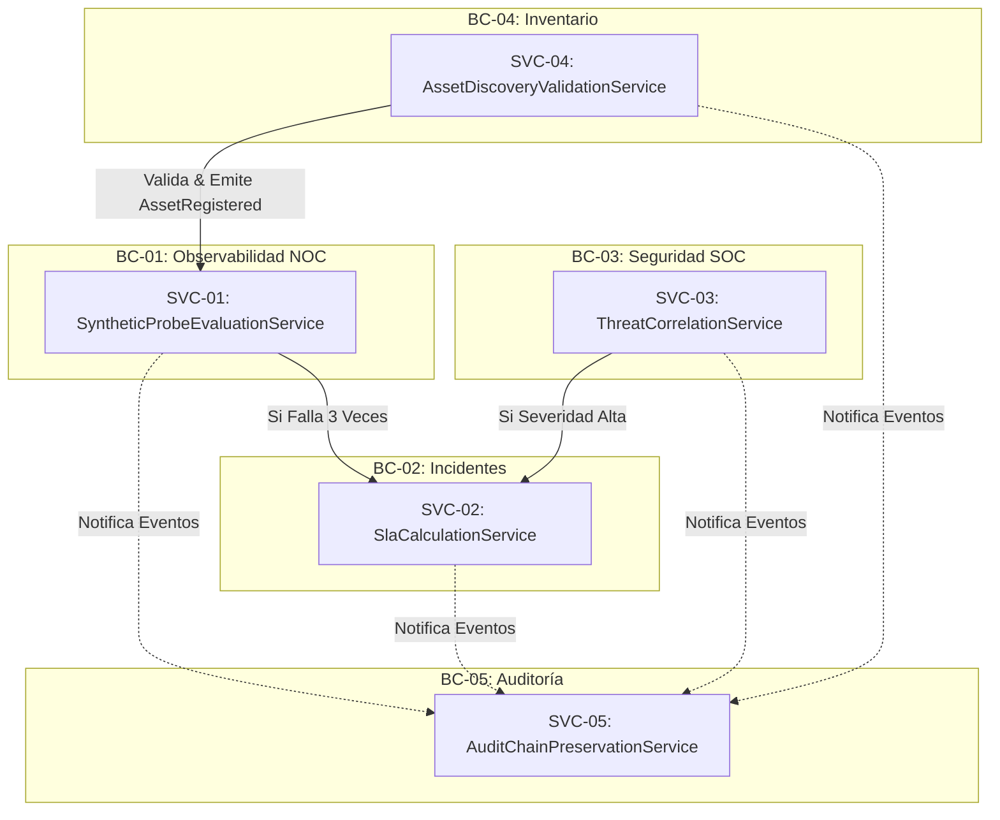

# 2.7 DOMAIN SERVICES — GESTIVASEC V1
> **Estado**: Descubrimiento de Dominio (DDD)  
> **Comité**: Principal Domain Architect & DDD Expert — Equipo Completo de Ingeniería  
> **Fase**: DOMAIN DISCOVERY — Subfase 2.7  
> **Fecha**: 2026-07-25  

---

## 1. Resumen Ejecutivo

La subfase **2.7 Domain Services** descubre y documenta los **Servicios de Dominio (Domain Services)** de **GestivaSec V1**. En cumplimiento estricto de los patrones de Domain-Driven Design (DDD), se definen 5 Servicios de Dominio que encapsulan lógica pura de negocio, reglas de cálculo u orquestaciones entre Agregados dentro de sus Bounded Contexts, sin diseñar controladores API, endpoints ni lógica de infraestructura o persistencia.

---

## 2. Service Catalog (Catálogo Detallado de Servicios de Dominio)

### SVC-01: `SyntheticProbeEvaluationService`
- **Nombre**: `SyntheticProbeEvaluationService`
- **Bounded Context**: `BC-01` (Synthetic Observability & Probing Context)
- **Responsabilidad**: Evaluar el resultado de ejecuciones sintéticas consecutivas sobre un `AssetAggregate`, calcular desviaciones de latencia y determinar la transición de estado del `SyntheticProbeAggregate` a `FAILING` o `HEALTHY`.
- **Entradas**: `ProbeExecutionResult`, umbrales de latencia de `AssetConfiguration`.
- **Salidas**: Transición de estado del Agregado de Sonda Sintética.
- **Eventos Emitidos / Reaccionados**: Emite `SyntheticCheckFailed` o `SyntheticCheckSucceeded`.
- **Dependencias**: `AGG-01` (AssetAggregate), `AGG-02` (SyntheticProbeAggregate).
- **Owner**: Ingeniero NOC

---

### SVC-02: `SlaCalculationService`
- **Nombre**: `SlaCalculationService`
- **Bounded Context**: `BC-02` (Incident Management & RCA Context)
- **Responsabilidad**: Calcular determinísticamente el `SlaDeadline` y vigilar el tiempo restante para la resolución de un incidente P1-P4 basándose en la prioridad declarada y la criticidad del activo.
- **Entradas**: Value Object `Priority`, fecha de declaración, criticidad del activo.
- **Salidas**: Value Object `SlaDeadline` inmutable.
- **Eventos Emitidos / Reaccionados**: Emite `SlaBreachWarning` si el margen restante es ≤ 15 minutos.
- **Dependencias**: `AGG-03` (IncidentAggregate), `AGG-01` (AssetAggregate).
- **Owner**: Analista SOC / Ingeniero NOC

---

### SVC-03: `ThreatCorrelationService`
- **Nombre**: `ThreatCorrelationService`
- **Bounded Context**: `BC-03` (Security Posture & Vulnerability Context)
- **Responsabilidad**: Correlacionar múltiples `SecurityFindingAggregate` u anomalías perimetrales detectadas sobre el mismo activo para determinar si constituyen un ataque coordinado.
- **Entradas**: Lista de `SecurityFindingAggregate`, eventos de seguridad perimetrales.
- **Salidas**: Evaluación de riesgo coordinado y recomendación de triaje P1.
- **Eventos Emitidos / Reaccionados**: Emite `ThreatAnomalyDetected`.
- **Dependencias**: `AGG-04` (SecurityFindingAggregate), `AGG-01` (AssetAggregate).
- **Owner**: Analista SOC / Security Architect

---

### SVC-04: `AssetDiscoveryValidationService`
- **Nombre**: `AssetDiscoveryValidationService`
- **Bounded Context**: `BC-04` (Asset Inventory & Topology Context)
- **Responsabilidad**: Validar que todo activo propuesto cumpla con las reglas de dominios autorizados (`gestivaone.com`, `gestivaone-store.vercel.app`, `festa.gestivaone.com`) y verificar que no exista duplicación en el inventario.
- **Entradas**: Solicitud de registro de activo (`TargetUrl`, `TenantId`).
- **Salidas**: Dictamen de validación de negocio (Aprobado / Rechazado).
- **Eventos Emitidos / Reaccionados**: Emite `AssetRegistered` o evento de rechazo por política.
- **Dependencias**: `AGG-01` (AssetAggregate).
- **Owner**: Ingeniero DevSecOps

---

### SVC-05: `AuditChainPreservationService`
- **Nombre**: `AuditChainPreservationService`
- **Bounded Context**: `BC-05` (Immutable Audit & Governance Context)
- **Responsabilidad**: Garantizar la inmutabilidad y ordenamiento secuencial infalsificable de la cadena de eventos de auditoría no repudiables.
- **Entradas**: Eventos de dominio emitidos por cualquier Bounded Context.
- **Salidas**: Instancia de `AuditLogRecord` inmutable.
- **Eventos Emitidos / Reaccionados**: Emite `AuditEventRecorded`.
- **Dependencias**: `AGG-05` (AuditLogAggregate).
- **Owner**: Auditor de Cumplimiento / CTO

---

## 3. Service Relationships & Flow Diagram (Mermaid)



---

## 4. Business Responsibilities Matrix

| Servicio de Dominio | Bounded Context | Responsabilidad Empresarial | Owner |
| :--- | :--- | :--- | :--- |
| `SVC-01: SyntheticProbeEvaluationService` | `BC-01` Observabilidad | Evaluación de salud y latencia de sondas NOC | Ingeniero NOC |
| `SVC-02: SlaCalculationService` | `BC-02` Incidentes | Cálculo de límites temporales SLAs para incidentes P1-P4 | Analista SOC / NOC |
| `SVC-03: ThreatCorrelationService` | `BC-03` Seguridad SOC | Correlación de hallazgos para detectar ataques coordinados | Security Architect |
| `SVC-04: AssetDiscoveryValidationService` | `BC-04` Inventario | Validación de pertenencia de dominios al inventario | DevSecOps |
| `SVC-05: AuditChainPreservationService` | `BC-05` Auditoría | Preservación de la cadena inmutable de registros auditados | Auditor / CTO |

---

## 5. Información Confirmada

- **CONF-SVC-01**: Los 5 Servicios de Dominio concentran la lógica pura de negocio que trasciende la responsabilidad de un solo Agregado.
- **CONF-SVC-02**: Ningún Servicio de Dominio representa una API REST, endpoint HTTP o controlador web.

---

## 6. UNKNOWNS & ASSUMPTIONS TO VALIDATE

- **UNK-SVC-01**: Posible extensión de `ThreatCorrelationService` para recibir feeds externos de inteligencia de amenazas en fases futuras.

---

## 7. Recomendaciones

- Aprobar la subfase **2.7 Domain Services** para autorizar el avance a la subfase **2.8 Context Mapping & Integration Patterns**.

---

## 8. Architecture Confidence

```
Architecture Confidence: 95%
```

---

## 9. READY FOR REVIEW
